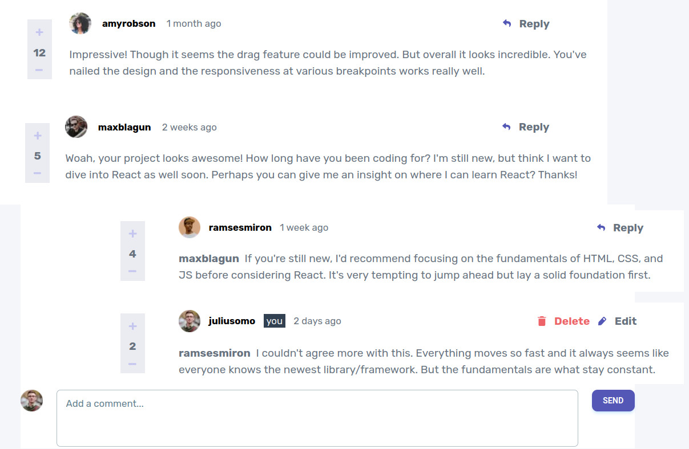

# Frontend Mentor - Interactive comments section solution

This is a solution to the [Interactive comments section challenge on Frontend Mentor](https://www.frontendmentor.io/challenges/interactive-comments-section-iG1RugEG9). Frontend Mentor challenges help you improve your coding skills by building realistic projects.

## Table of contents

- [Overview](#overview)
  - [The challenge](#the-challenge)
  - [Screenshot](#screenshot)
  - [Links](#links)
- [My process](#my-process)
  - [Built with](#built-with)
  - [What I learned](#what-i-learned)
  - [Continued development](#continued-development)
  - [Useful resources](#useful-resources)
- [Author](#author)
- [Acknowledgments](#acknowledgments)

**Note: Delete this note and update the table of contents based on what sections you keep.**

## Overview

### The challenge

Users should be able to:

- View the optimal layout for the app depending on their device's screen size
- See hover states for all interactive elements on the page
- Create, Read, Update, and Delete comments and replies
- Upvote and downvote comments
- **Bonus**: If you're building a purely front-end project, use `localStorage` to save the current state in the browser that persists when the browser is refreshed.
- **Bonus**: Instead of using the `createdAt` strings from the `data.json` file, try using timestamps and dynamically track the time since the comment or reply was posted.

### Screenshot



### Links

- Solution URL: [Add solution URL here](https://github.com/ttsoares/Dialogs)
- Live Site URL: [Add live site URL here](https://interactive-comments-drab.vercel.app/)

### Built with

- [Prisma](https://www.prisma.io/) - An ORM for NextJS
- [Material-Tailwind](https://www.material-tailwind.com/) - CSS library
- [React](https://reactjs.org/) - JS library
- [Next.js](https://nextjs.org/) - React framework
- [Styled Components](https://styled-components.com/) - For styles

### What I learned

Started the process of building the full CRUD system with Prisma and PostgreSQL

```js
model User {
  id          String   @id @default(uuid())
  username    String   @unique
  coments     Coment[]
  avatar_png  Bytes
  avatar_webp Bytes
  Reply       Reply[]
}

model Coment {
  id        String   @id @default(uuid())
  content   String   @db.Text
  owner     User     @relation(fields: [ownerId], references: [id])
  ownerId   String
  createdAt DateTime @default(now())
  score     Int
  comenter  String
  replyes   Reply[]
}

model Reply {
  id         String   @id @default(uuid())
  content    String   @db.Text
  coment     Coment   @relation(fields: [comentId], references: [id])
  comentId   String
  createdAt  DateTime @default(now())
  score      Int
  replyingTo String
  comenter   User     @relation(fields: [comenterId], references: [id])
  comenterId String
}
```

### Continued development

Will eventually finish the backed system to achieve a fullstack CRUD system.

### Useful resources

- [Prisma](https://www.prisma.io/docs/guides/deployment/deployment-guides/deploying-to-vercel) - Deploy to Vercel rally easy...

## Author

- Website - [Thomas Tschoepke Soares](https://www.linkedin.com/in/thomas-soares-6791781b/)
- Frontend Mentor - [@ttsoares](https://www.frontendmentor.io/profile/ttsoares)

## Acknowledgments

- Tutorial - [Step By Step Guide to Next.js13 Tailwind Prisma Postgresql](https://www.youtube.com/watch?v=gxkwMm_j850&pp)
